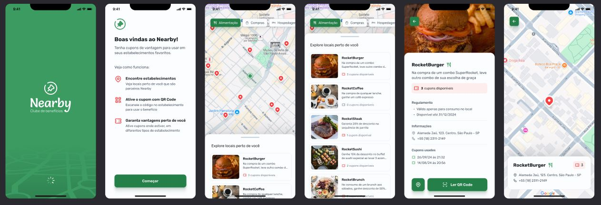

# Boas-vindas ao projeto Nearby App

Fala, dev 👋

Esse projeto é parte de um curso que fiz para praticar meus conhecimentos. Embora não seja a minha primeira experiência com **React Native**, pois já desenvolvi outros aplicativos anteriormente, achei interessante o conteúdo do curso e resolvi fazê-lo para reforçar e praticar ainda mais minhas habilidades. Acredito que a prática constante é essencial para o desenvolvimento como dev, e essa foi uma ótima oportunidade para aprimorar minhas técnicas.

O projeto **Nearby App** é um aplicativo mobile de clube de benefícios com cupons para utilizar em estabelecimentos próximos a você.

Esse é um projeto do evento **NLW Pocket Mobile**

---

## Overview do Projeto

O **Nearby App** oferece as seguintes funcionalidades principais:

- **Localização**: O aplicativo usa a localização do dispositivo para identificar estabelecimentos próximos a você.
- **Leitura de QRCode**: O aplicativo utiliza a câmera do dispositivo para escanear QRCodes, permitindo o resgate de cupons.




---

## Como executar o projeto

Para executar o **Nearby App**, você precisa clonar o repositório, instalar as dependências e rodar tanto a API quanto o projeto mobile.

### **1. Clonando o Repositório**

```bash
# Clone o repositório
git clone https://github.com/Renannr/nlw-pocket-mobile.git

# Entre na pasta do projeto
cd nlw-pocket-mobile
```

### **2. Configurando e executando a API**

A API foi desenvolvida em **Node.js** com **Prisma**.

```bash
# Entre na pasta da API
cd api

# Instale as dependências
npm install

# Inicie o servidor
npm start
```

A API rodará na porta **3333** (ou conforme configuração).

### **3. Configurando e executando o Mobile**

```bash
# Volte para a raiz do projeto e entre na pasta mobile
cd ../mobile

# Instale as dependências
npm install

# Execute o projeto
npx expo start
```

---

Agora, o projeto **Nearby App** estará rodando localmente! 🚀

Abra o aplicativo utilizando um emulador ou um dispositivo físico com o **Expo Go**.

---

### Tecnologias Utilizadas

- **React Native**
- **Expo**
- **Expo Router**
- **Node.js**
- **Prisma**
- **TypeScript**
- **Design Pattern: Composition**
